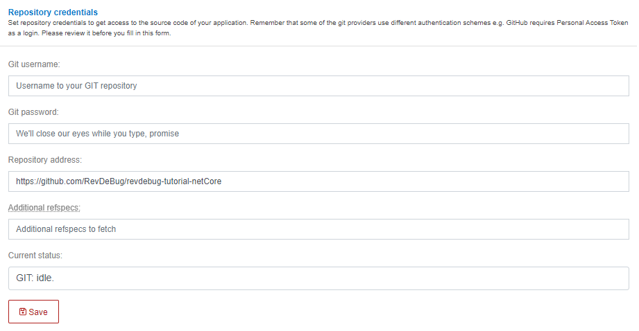

# RevDeBug recording of a ASP.NET Core application demo
The following application is an example ASP.NET Core application showing the tracing and code execution recording of RevDeBug.
A prerequisite for this follow along tutorial is a working RevDeBug Server instance running, please refer to user manual at: <https://revdebug.gitbook.io/revdebug/installing-revdebug-server#setting-up-revdebug-server-instance>
## Clone the project (Linux/MacOS X machine with Docker installed recommended)

It is easier to start with the demo using in-memory database that't why it is recommended to use the ```inmemory_database``` branch:

```
git clone --single-branch --branch feat/inmemory_database https://github.com/RevDeBug/revdebug-tutorial-netCore

cd revdebug-tutorial-netCore
```

## Build the application using the included Dockerfile (RevDeBug server without SSL)

```
docker build --build-arg REVDEBUG_RECORD_SERVER_ADDRESS_ARG=[revdebug_server_address] -t rdb_core_demo .
```

## If you are using RevDeBug server with SSL

```
docker build --build-arg REVDEBUG_RECORD_SERVER_ADDRESS_ARG=[revdebug_server_address] --build-arg REVDEBUG_TLS=true -t rdb_core_demo .
```

Where *[revdebug_server_address]* is your RevDeBug server address (IP address or just the hostname).

## Run the built Docker image 

```
docker run -d -p 8090:80 --name rdb_core_demo rdb_core_demo:latest
```

Where *[revdebug_server_address]* is your RevDeBug server address (IP address or just the hostname).

## Use the application to cause its error

Afterwards the application will be accessible through a web browser at: <http://localhost:8090/>

Navigate to Invoices web page.


Select the invoice that came from: Exceptional LLC, access the details of the invoice and press the "Reconcile" link.


It will result with an error - you may see a "blank" or an error 500 web page at this time.

# Use RevDeBug to access code execution recording

## Find the errorneous trace
Next, you may switch to a RevDeBug server web interface and navigate to the “Trace” tab, where you may filter the traces to show only errors and limit to application “InvoiceJava”. 


There you’ll find the trace for the caused error and you can access the recording of code execution. Accessing the recording for the first time will ask to configure the source code repository address.

## Connect code repository (one time action)

Follow the “connect to repository” option and fill the “Repository address” to github repository location of  ```https://github.com/RevDeBug/revdebug-tutorial-netCore``` and press “Save”.



## Access the code execution for the error
Closing the inner window and reopening the code recording will present the recording on the source code and allow you to move around the recording timeline using the arrow buttons at top left.


